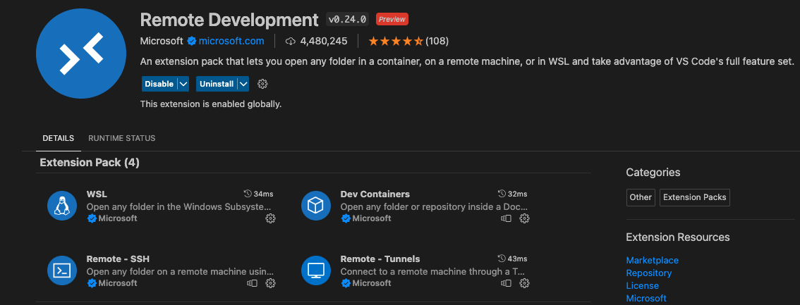

# Setup

Please perform the following steps below before the workshop:

## Registration to Classiq Platform

1. Register to [Classiq](https://classiq.io).

## Visual Studio Code and Extensions

0. Make sure to have Python installed.

1. Download the Python script [setup_remote.py](resources/setup/setup_remote.py){:download="setup_remote.py"}
2. Run `setup_remote.py gpu-name user-name`, the last two fields 
   will be provided at the workshop.

1. Install [Visual Studio Code](https://code.visualstudio.com) and 
   open a new window.
2. Install Remote Development Extension Pack (see image below).
3. Press Ctrl+Shift+P (or CMD+Shift+P in Mac) and 
   choose `Remote-SSH: Connect to Host…`.
4. Choose `qal-workshop~host`.
5. Install the following extensions : C/C++ Extension Pack and CMake 
   Tools.

## Workshop Files

1. In your project, open a folder named `qal-workshop`.
2. Download the following files. **Keep the folder structure as 
   shown**.

qal-workshop  
├─[CMakeLists.txt](resources/qal_workshop/CMakeLists.txt){:download="CMakeLists.txt"}  
├─include  
│ ├─[grover_cli_tools.hpp](resources/qal_workshop/include/grover_cli_tools.hpp){:download="grover_cli_tools.hpp"}  
├─src  
│ ├─[grover_cli_tools.cpp](resources/qal_workshop/src/grover_cli_tools.cpp){:download="grover_cli_tools.cpp"}  
│ ├─[grover_example.cpp](resources/qal_workshop/src/grover_example.cpp){:download="grover_example.cpp"}  
│ ├─[grover_cli.cpp](resources/qal_workshop/src/grover_cli.cpp){:download="grover_cli.cpp"}  

## Building the Project

1. Press Ctrl+Shift+P (CMD+Shift+P) and choose `CMake: 
   Configure`
2. Press Ctrl+Shift+P (CMD+Shift+P) and choose `CMake: 
   Build`